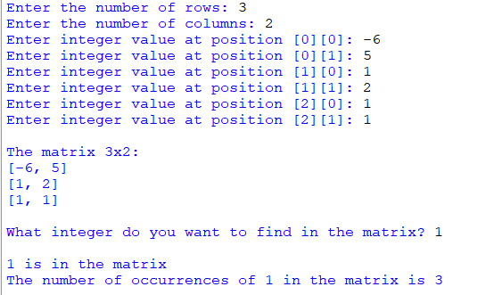

## Description
This program prompts users to input the dimensions of a matrix, fills it with integers provided by the user, displays the matrix, and enables users to find the occurrences of a specific integer within the matrix. The program counts and presents the total occurrences of the specified integer in the matrix.
## Example
♡ Example 1  

  

♡ Example 2   
  

